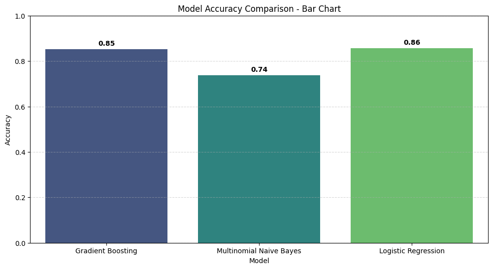

# 🔎 Fake News Classifier — Classyfire

A professional, end-to-end guide to reproduce the **Fake News Classifier** experiment from the notebook `Fake_New_Classyfire.ipynb`.

This README contains:

* A full project overview (what the notebook does and why)
* Step‑by‑step runnable code snippets for preprocessing, training multiple models, and inference
* Instructions to generate and save a **performance comparison image** (bar chart + confusion matrices)
* Reproducibility tips and `requirements.txt`

---

## 📚 Project overview

The notebook builds a binary classifier that separates **FAKE** and **REAL** news articles. The pipeline in the notebook performs the following main steps:

1. **Load the dataset** (`fake_or_real_news.csv` or similar). The notebook uses columns such as `title`, `text`, and `label` (0 = FAKE, 1 = REAL).
2. **Text preprocessing** with **spaCy** (tokenization, lemmatization, stopword removal, punctuation removal, removal of named entities and short tokens).
3. **Feature extraction** using pre-trained vectors: either spaCy's `en_core_web_lg` or external word2vec (gensim) - the notebook averages token vectors per document to obtain fixed-length feature vectors.
4. **Model training** on the fixed-size vectors (Logistic Regression is the primary model in the notebook; the README provides additional comparator models).
5. **Evaluation** using accuracy, precision, recall, F1-score and confusion matrices.

Why average word vectors? Averaging word vectors is a simple and effective way to create document-level embeddings when you don't want to fine-tune large transformer models. It is fast, compact, and straightforward to run on typical machines.

---

## 🧩 Files you should have

* `Fake_New_Classyfire.ipynb` — the original notebook (analysis & exploration)
* `fake_or_real_news.csv` — dataset (CSV with `title`, `text`, `label`)
* `README.md` — this file

---

## ⚙️ Requirements

Create a virtual environment and install the packages listed in `requirements.txt` (also shown below).

**requirements.txt**

```
numpy
pandas
scikit-learn
matplotlib
seaborn
spacy
gensim
joblib
jupyterlab
```

Install spaCy language model (once):

```bash
python -m spacy download en_core_web_lg
```

---

## 🛠 Step-by-step: reproduce everything (copy & run)

> The notebook does heavy lifting with spaCy and gensim. Below are ready-to-run scripts/snippets that match the notebook's pipeline.

### 1) Load dataset

```python
# load_data.py
import pandas as pd

DATA_PATH = 'fake_or_real_news.csv'  # change to your file name

df = pd.read_csv(DATA_PATH)
print('Rows:', len(df))
print(df.columns)
# Expect columns: title, text, label
```

### 2) Preprocessing with spaCy (lemmatize, remove stopwords/ents/punct)

```python
# preprocess.py
import spacy
import re
from tqdm import tqdm

nlp = spacy.load('en_core_web_lg', disable=['parser'])  # keep 'ner' to optionally remove entities

REMOVE_SHORT = 2

def clean_doc(text):
    # Basic normalization
    text = re.sub(r"\s+", ' ', str(text)).strip()
    doc = nlp(text)
    tokens = []
    for token in doc:
        # remove stopwords, punctuation, numbers and very short tokens
        if token.is_stop or token.is_punct or token.like_num:
            continue
        if len(token.text) <= REMOVE_SHORT:
            continue
        if token.ent_type_:  # skip named entities (optional)
            continue
        tokens.append(token.lemma_.lower())
    return ' '.join(tokens)

# Example usage
# df['content'] = (df['title'].fillna('') + ' ' + df['text'].fillna('')).apply(clean_doc)
```

**Notes:**

* We remove named entities to reduce bias from named entities (optional — you can change behavior by removing the `if token.ent_type_` check).
* Use `nlp.pipe()` in production to speed up preprocessing for many documents.

### 3) Build document vectors (two options)

#### Option A — Use spaCy document vectors (fast, uses `en_core_web_lg`):

```python
# features_spacy.py
import numpy as np

# df['content'] must be preprocessed text or raw text (spaCy handles tokenization)

def build_spacy_vectors(texts):
    vectors = []
    for doc in nlp.pipe(texts, batch_size=64, disable=['parser']):
        # doc.vector is the average vector (300 or 384-d depending on model)
        vectors.append(doc.vector)
    return np.vstack(vectors)

# X = build_spacy_vectors(df['content'].tolist())
```

#### Option B — Use Gensim GoogleNews word2vec or custom word2vec and average tokens

```python
# features_gensim.py
import numpy as np
from gensim.models import KeyedVectors

# Load pretrained KeyedVectors (example path; large file ~1.5GB)
# w2v = KeyedVectors.load_word2vec_format('GoogleNews-vectors-negative300.bin', binary=True)

EMBED_SIZE = 300

def build_avg_w2v(texts, w2v):
    vecs = []
    for text in texts:
        tokens = [t for t in text.split() if t in w2v]
        if tokens:
            v = np.mean([w2v[t] for t in tokens], axis=0)
        else:
            v = np.zeros(EMBED_SIZE, dtype=float)
        vecs.append(v)
    return np.vstack(vecs)

# X = build_avg_w2v(df['content'].tolist(), w2v)
```

> Recommendation: use **Option A (spaCy)** unless you specifically need the GoogleNews vectors. SpaCy's `en_core_web_lg` is already convenient and fast.

### 4) Train/test split

```python
# split.py
from sklearn.model_selection import train_test_split

# y: 0 = FAKE, 1 = REAL
X = ...  # features from step 3 (numpy array)
y = df['label'].values

X_train, X_test, y_train, y_test = train_test_split(X, y, test_size=0.2, stratify=y, random_state=42)
```

### 5) Train multiple models (compare performance)

We provide pipelines for:

* **Logistic Regression** (works well with dense embeddings)
* **Random Forest** (robust tree-based baseline)
* **SVM (LinearSVC)** (strong margin-based classifier)
* Optional: **TF-IDF + MultinomialNB** (classic text baseline — uses sparse TF-IDF features)

```python
# train_models.py
from sklearn.linear_model import LogisticRegression
from sklearn.ensemble import RandomForestClassifier
from sklearn.svm import LinearSVC
from sklearn.naive_bayes import MultinomialNB
from sklearn.feature_extraction.text import TfidfVectorizer
from sklearn.pipeline import make_pipeline
from sklearn.metrics import accuracy_score, precision_recall_fscore_support
import joblib

# 1) Embedding-based models (use dense X_train / X_test)
logreg = LogisticRegression(max_iter=1000)
rf = RandomForestClassifier(n_estimators=200, random_state=42)
svc = LinearSVC(max_iter=5000)

logreg.fit(X_train, y_train)
rf.fit(X_train, y_train)
svc.fit(X_train, y_train)

# Save models
joblib.dump(logreg, 'model_logreg.joblib')
joblib.dump(rf, 'model_rf.joblib')
joblib.dump(svc, 'model_svc.joblib')

# 2) TF-IDF + MultinomialNB (text-based baseline)
# Only run if you kept raw/preprocessed text (not averaged vectors)
# tfidf = TfidfVectorizer(stop_words='english', max_df=0.75)
# nb_pipeline = make_pipeline(tfidf, MultinomialNB())
# nb_pipeline.fit(raw_X_train_texts, y_train)
# joblib.dump(nb_pipeline, 'model_nb_tfidf.joblib')
```

### 6) Evaluate & generate performance image

```python
# evaluate_and_plot.py
import numpy as np
import matplotlib.pyplot as plt
import seaborn as sns
from sklearn.metrics import confusion_matrix, classification_report
import joblib

models = {
    'LogisticRegression': joblib.load('model_logreg.joblib'),
    'RandomForest': joblib.load('model_rf.joblib'),
    'LinearSVC': joblib.load('model_svc.joblib'),
    # 'NB-TFIDF': joblib.load('model_nb_tfidf.joblib')  # if you trained it
}

results = {}
for name, mdl in models.items():
    # For embedding-based models, we have X_test
    y_pred = mdl.predict(X_test)
    acc = np.mean(y_pred == y_test)
    prec, recall, f1, _ = precision_recall_fscore_support(y_test, y_pred, average='binary')
    results[name] = {'accuracy': acc, 'precision': prec, 'recall': recall, 'f1': f1}
    print(f"\nModel: {name}")
    print(classification_report(y_test, y_pred, target_names=['FAKE', 'REAL']))

# Plot bar chart comparing accuracies / f1-scores
labels = list(results.keys())
accs = [results[m]['accuracy'] for m in labels]
f1s = [results[m]['f1'] for m in labels]

x = np.arange(len(labels))
width = 0.35
fig, ax = plt.subplots(figsize=(10,5))
rects1 = ax.bar(x - width/2, accs, width, label='Accuracy')
rects2 = ax.bar(x + width/2, f1s, width, label='F1-score')
ax.set_xticks(x)
ax.set_xticklabels(labels)
ax.set_ylim(0,1)
ax.set_ylabel('Score')
ax.set_title('Model Comparison — Accuracy & F1-score')
ax.legend()

# Save figure
plt.tight_layout()
plt.savefig('model_comparison.png', dpi=200)
plt.show()

# Save confusion matrix figure for top model (example)
best_model_name = max(results, key=lambda k: results[k]['f1'])
best_model = models[best_model_name]
cm = confusion_matrix(y_test, best_model.predict(X_test))
plt.figure(figsize=(6,5))
sns.heatmap(cm, annot=True, fmt='d', cmap='Blues', xticklabels=['FAKE','REAL'], yticklabels=['FAKE','REAL'])
plt.xlabel('Predicted')
plt.ylabel('Actual')
plt.title(f'Confusion Matrix — {best_model_name}')
plt.savefig('confusion_matrix_best.png', dpi=200)
plt.show()
```

**After running the above**, you will have two image files:

* `model_comparison.png` — bar chart comparing Accuracy & F1 for each model
* `confusion_matrix_best.png` — confusion matrix for the best-performing model

You can open or embed those images in your GitHub README or notebook results.

---

## 🔎 Quick inference script (test single samples)

```python
# predict_sample.py
import joblib
import numpy as np
import spacy

nlp = spacy.load('en_core_web_lg', disable=['parser'])

# load best model (or whichever you want)
model = joblib.load('model_logreg.joblib')

LABELS = {0: 'FAKE', 1: 'REAL'}

def preprocess_text(text):
    doc = nlp(text)
    tokens = [t.lemma_.lower() for t in doc if not t.is_stop and not t.is_punct and not t.like_num and len(t.text) > 2 and not t.ent_type_]
    return ' '.join(tokens)

def text_to_vector(text):
    doc = nlp(text)
    return doc.vector.reshape(1, -1)

if __name__ == '__main__':
    samples = [
        'NASA confirms water on Mars after new rover mission.',
        'Celebrity dies in shocking accident: details emerge with photos.',
    ]
    for s in samples:
        cleaned = preprocess_text(s)
        vec = text_to_vector(cleaned)
        pred = model.predict(vec)[0]
        print(f"INPUT: {s}\nPRED: {LABELS[pred]}\n")
```


---

Performance with deferent models 




---

## ✅ Reproducibility & best practices

* Set random seeds in NumPy / scikit-learn to make splits and model training deterministic.
* Use `nlp.pipe()` and `batch_size` to speed preprocessing.
* If your dataset is imbalanced, consider stratified sampling, class weights, or resampling techniques.
* Be mindful of named entity removal — it reduces some bias but might remove signal in certain cases.

---

## 📝 Summary of the notebook-specific choices (what I extracted)

* The notebook uses spaCy (`en_core_web_lg`) for tokenization, lemmatization, stopword removal and document vectors.
* Gensim and pre-trained Word2Vec models are installed as alternatives in the notebook (optional).
* Training primarily used a Logistic Regression classifier on averaged document vectors.
* The notebook contains evaluation code for accuracy and confusion matrix generation.

---

## 🤝 Next steps — I can help with any of the following

* Create the actual Python script files (`preprocess.py`, `train_models.py`, `evaluate_and_plot.py`, `predict_sample.py`) in the repo for you.
* Run the notebook here and generate `model_comparison.png` and `confusion_matrix_best.png` (I can run them if you want me to create and run code in this environment).
* Add a short GitHub Actions workflow to train the model and create performance artifacts.

Tell me which of the above you want me to do next and I will proceed.
